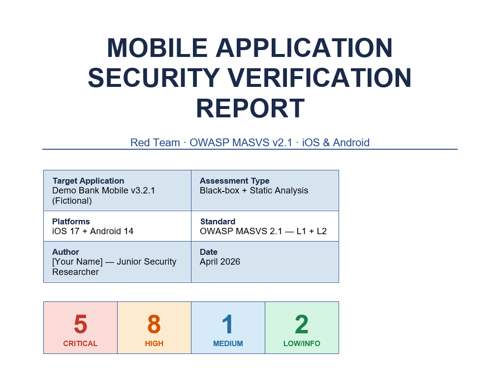

# Mobile Application Security Verification

> **Portfolio project** · OWASP MASVS v2.1 · iOS & Android · Red Team

A personal security research project assessing a fictional mobile banking application against the OWASP Mobile Application Security Verification Standard. Built to develop practical pentesting skills across iOS and Android.

---

## Quick Start

```bash
# 1. Clone and install
git clone https://github.com/YOUR_USERNAME/mobile-security-verification.git
cd mobile-security-verification
npm install

# 2. Launch interactive terminal dashboard
npm start

# 3. Generate Word report
npm run generate-report
# → output/mobile_pentest_report.docx
```

---

## Project Structure

```
mobile-security-verification/
├── data/
│   └── findings.js          # All 14 findings — single source of truth
├── scripts/
│   ├── dashboard.js         # Interactive terminal dashboard (npm start)
│   └── ecb-detector.py      # AES-ECB block pattern detector
├── report/
│   └── generate-report.js   # Generates full Word document report
├── frida-scripts/
│   ├── F001-jwt-hook.js     # Hook JWT signing to find hardcoded secret
│   ├── F002-storage-monitor.js  # Monitor all storage writes
│   ├── F003-ssl-bypass.js   # SSL pinning bypass (Android + iOS)
│   ├── F004-deeplink-monitor.js # Deeplink path traversal detection
│   ├── F005-pasteboard-hook.js  # iOS pasteboard write monitor
│   ├── F006-crypto-monitor.js   # Weak cipher detection (ECB/MD5/SHA1)
│   ├── F007-pin-bruteforce.js   # PIN brute-force demo (no lockout)
│   ├── F008-keychain-monitor.js # iOS Keychain accessibility audit
│   └── F012-prng-monitor.js     # Weak PRNG detection
├── output/                  # Generated report goes here (gitignored)
└── docs/                    # Additional writeup notes
```

---

## Findings Summary

| ID | Severity | Title | Platform | CVSS |
|----|----------|-------|----------|------|
| F-001 | 🔴 CRITICAL | JWT secret hardcoded in binary | Both | 9.8 |
| F-002 | 🔴 CRITICAL | Cleartext PII in SharedPreferences | Android | 9.1 |
| F-003 | 🔴 CRITICAL | SSL pinning not implemented | Both | 8.8 |
| F-004 | 🔴 CRITICAL | Deeplink path traversal — arbitrary file write | Android | 9.3 |
| F-005 | 🔴 CRITICAL | Auth token written to iOS pasteboard | iOS | 8.5 |
| F-006 | 🟠 HIGH | AES-ECB mode for local encryption | Both | 7.4 |
| F-007 | 🟠 HIGH | No brute-force protection on PIN | Both | 7.1 |
| F-008 | 🟠 HIGH | Keychain accessible via iCloud backup | iOS | 6.8 |
| F-009 | 🟠 HIGH | Static API keys, no rotation | Both | 7.2 |
| F-010 | 🟠 HIGH | Exported activity, no permission check | Android | 6.5 |
| F-011 | 🔵 MEDIUM | FLAG_SECURE missing on sensitive screens | Android | 4.3 |
| F-012 | 🔵 MEDIUM | Weak PRNG for session token generation | Both | 5.9 |
| F-013 | 🟢 LOW | Debug symbols in release IPA | iOS | 2.7 |
| F-014 | ℹ️ INFO | Stack traces written to Logcat | Android | 0.0 |

---

## Dashboard Commands

```
masvs> list                  # All findings table
masvs> list critical         # Filter by severity
masvs> detail F-001          # Full finding detail with exploit steps
masvs> coverage              # MASVS control pass/fail matrix
masvs> stats                 # Visual breakdown by category + platform
masvs> report                # Generate Word document
```

### Dashboard Screenshots




---

## Frida Scripts

Each script targets a specific finding. Run on a rooted/jailbroken device with `frida-server` deployed:

```bash
# Android — general usage
frida -U -f com.target.app -l frida-scripts/F003-ssl-bypass.js

# iOS — general usage
frida -U -f com.target.app -l frida-scripts/F005-pasteboard-hook.js

# Monitor all crypto operations
frida -U -f com.target.app -l frida-scripts/F006-crypto-monitor.js

# Detect weak PRNG
frida -U -f com.target.app -l frida-scripts/F012-prng-monitor.js
```

### F-001 — JWT Hook
Intercepts JWT library calls to surface hardcoded signing secrets at runtime. Works with JJWT and Auth0 java-jwt.

### F-003 — SSL Bypass (Android + iOS)
Full SSL pinning bypass covering:
- `TrustManager` replacement
- `OkHttp CertificatePinner`
- `Conscrypt OpenSSLSocketImpl`
- iOS `SecTrustEvaluate` / `SecTrustEvaluateWithError`
- iOS `URLSession` challenge handler

### F-006 — Crypto Monitor
Flags weak algorithms at runtime: ECB mode, CBC, RC4, DES, MD5, SHA-1. Logs key material and IV usage (missing IV = ECB confirmation).

### F-007 — PIN Brute-Force Demo
Demonstrates the absence of lockout by iterating PINs with no rate limiting triggered. Hooks the validation method and logs all attempts and results.

---

## ECB Detector

```bash
# Analyse a binary file for AES-ECB block repetitions
python3 scripts/ecb-detector.py path/to/cache.bin
```

Output shows repeated 16-byte blocks — the signature of ECB mode encryption.

---

## Methodology

| Phase | Activities |
|-------|-----------|
| Recon & Setup | Jailbreak/root, frida-server, Burp Suite proxy, IPA/APK extraction |
| Static Analysis | jadx, apktool, class-dump, trufflehog secret scan, manifest audit |
| Dynamic Analysis | Frida hooks, objection, SSL bypass, deeplink fuzzing |
| Data Storage | SharedPreferences dump, Keychain enumeration, SQLite review |
| Network | TLS sweep, cert pinning bypass, API key harvest |
| Reporting | CVSS v3.1 scoring, MASVS mapping, Word report generation |

**Tools:** Frida · objection · jadx · apktool · Burp Suite · mitmproxy · class-dump · keychain-dumper · drozer · adb · trufflehog · jwt_tool · Ghidra

---

## Generate Report

```bash
node report/generate-report.js
# Saves to: output/mobile_pentest_report.docx
```

Full Word document with cover page, colour-coded severity tables, exploit steps for all 14 findings, MASVS coverage matrix, and remediation guidance.

---

## Disclaimer

This is a personal portfolio project. **DemoBank Mobile is a fictional application** created for this assessment in a controlled lab environment. No real users, real data, or production systems were involved.

All techniques were performed against an app I own and control. Published for educational purposes to demonstrate understanding of mobile security and OWASP MASVS controls. Always obtain written permission before testing any app you do not own.

---

## References

- [OWASP MASVS](https://mas.owasp.org/MASVS/)
- [OWASP MASTG](https://mas.owasp.org/MASTG/)
- [Frida](https://frida.re)
- [jadx](https://github.com/skylot/jadx)
- [objection](https://github.com/sensepost/objection)
- [CVSS v3.1](https://www.first.org/cvss/calculator/3.1)

---

*[Your Name] · Junior Security Researcher · April 2026*
